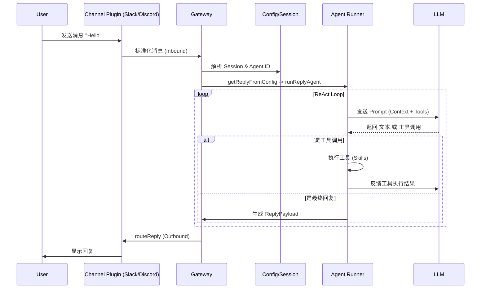

# 消息流程 (Message Flow)

本文档描述了消息从外部平台进入 OpenClaw，被 Agent 处理，最后返回响应的完整生命周期。

## 1. 入站流程 (Inbound)

当用户在 Slack/Discord 等平台发送消息时：

1.  **渠道接收**:
    *   特定渠道的插件（例如 `src/slack/monitor/message-handler/`）接收到 webhook 或 websocket 事件。
    *   插件将原始数据标准化为 OpenClaw 内部格式 (`ReplyPayload` 或类似结构)。

2.  **网关路由**:
    *   消息被发送到 Gateway。
    *   Gateway 根据 `SessionKey` (例如 `slack:workspace_id:channel_id`) 识别会话。
    *   Gateway 检查是否有对应的 Agent 正在运行，或者是否需要启动新的 Agent 实例。

3.  **预处理 (`src/auto-reply/reply/get-reply.ts`)**:
    *   **`getReplyFromConfig`**: 这是核心入口函数。
    *   **身份解析**: 确定由哪个 Agent (ID) 处理该消息 (`resolveSessionAgentId`)。
    *   **模型选择**: 根据配置或默认策略选择 LLM 模型 (`resolveDefaultModel`)。
    *   **技能加载**: 加载该 Agent 可用的技能 (`resolveAgentSkillsFilter`)。

## 2. 处理流程 (Processing)

一旦消息进入处理阶段：

1.  **准备运行 (`src/auto-reply/reply/get-reply-run.ts`)**:
    *   **`runPreparedReply`**: 准备 Agent 的运行环境。
    *   **`runReplyAgent`**: 实际启动 Agent 的执行逻辑 (`src/auto-reply/reply/agent-runner.ts`)。

2.  **Agent 执行 (`src/agents/`)**:
    *   Agent 加载历史上下文 (`src/agents/context.ts`)。
    *   Agent 构建 Prompt，包含系统提示词、可用技能描述和用户消息。
    *   **LLM 调用**: 请求大模型生成回复或工具调用指令。
    *   **工具执行**: 如果 LLM 请求调用工具（如 `github.list_issues`），OpenClaw 执行对应代码并获取结果。
    *   **循环 (ReAct)**: Agent 可能会进行多轮 "思考-执行-观察"，直到生成最终回复。

## 3. 出站流程 (Outbound)

当 Agent 生成了最终回复（文本或文件）：

1.  **路由回复 (`src/auto-reply/reply/route-reply.ts`)**:
    *   **`routeReply`**: 决定回复应该发送到哪里。通常是原路返回（回复到来源渠道）。

2.  **渠道发送**:
    *   调用对应渠道的发送接口（例如 `src/slack/send.ts`）。
    *   渠道插件将 OpenClaw 的标准消息格式转换为平台特定的 API 调用（如 Slack Block Kit）。

## 流程图

